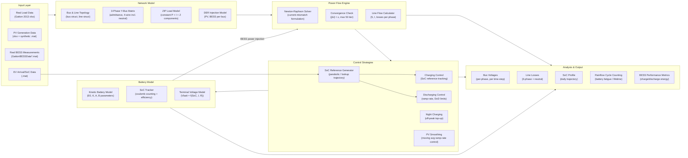
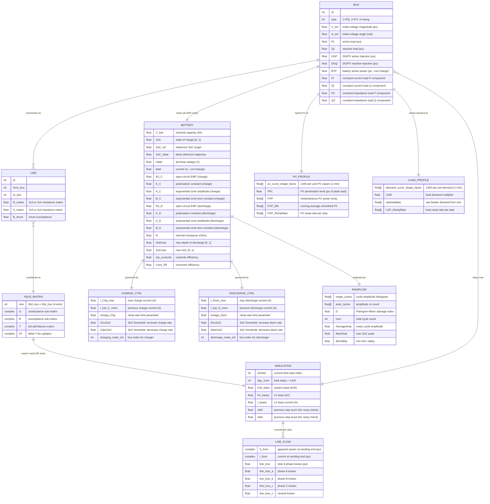

# First Review Diagrams

## Diagram 1 — Script Interrelation

```mermaid
flowchart TD
    subgraph ENTRY["Entry Points"]
        DSD["daily_sim.m"]
        DSDCD["daily_sim_combined_CD.m"]
        DSDCD1["daily_sim_combined_CD_test1.m"]
        DSDCD2["daily_sim_combined_CD_test2.m"]
        RR["randomrun.m"]
    end

    subgraph NETSETUP["Network Setup"]
        BB["bb_pv_cluster1.m\n(bus/line topology)"]
        YMAT["ymat_3ph3_4w.m\n(Y-matrix, initial state)"]
    end

    subgraph DATAINPUT["Data Loading"]
        DR["data_read.m"]
        DC["demand_curve.m"]
        PVC["pv_curve.m"]
    end

    subgraph SOLVER["Power Flow Solver"]
        NRCI["nrci3ph4w.m\n(NR iteration controller)"]
        CURR["curr_mm_3p3_4w.m\n(current mismatch calc)"]
        LF["lineflow_3p4w.m\n(line S and I flows)"]
    end

    subgraph CONTROL["Battery Control"]
        CC["charge_control.m"]
        DC2["discharge_control.m"]
        NCC["night_charge_control.m"]
        SMC["smoothing_control.m"]
        SOCREF["SoC_ref_gen.m\n(SoC reference trajectory)"]
        CDP["cdparam.m\n(battery parameters)"]
    end

    subgraph ANALYSIS["Post-Processing / Analysis"]
        RF["rainflow_bins.m\n(cycle life / fatigue)"]
        GBESS["gbess_perf1.m\n(BESS performance metrics)"]
    end

    subgraph DATAFILES["External Data Files"]
        XLSLOAD["Gatton Sub0 2013 Data Raw.xlsx\n(demand & PV raw data)"]
        MAT1["SoC_Arrival_random_IASpaper_data1.mat"]
        MATBESS["GattonBESSData*.mat\n(April / May / Jun / Aug)"]
        MATPV["data_highvarPV / smthPV / slightvarPV.mat"]
    end

    %% Entry → Network Setup
    DSD --> BB
    DSDCD --> BB
    DSDCD1 --> BB
    DSDCD2 --> BB
    RR -->|calls daily_sim_for_random_run| BB
    BB --> YMAT

    %% Entry → Data Loading
    DSD --> DR
    DSDCD --> DR
    DR --> DC
    DR --> PVC
    DC -->|xlsread| XLSLOAD
    PVC -->|xlsread| XLSLOAD

    %% Entry → SoC reference
    DSDCD --> SOCREF
    DSDCD --> CDP

    %% Entry → load random SoC data
    DSD -->|load mat| MAT1
    DSDCD -->|load mat| MAT1

    %% Entry → Solver loop
    DSD --> NRCI
    DSDCD --> NRCI
    NRCI --> CURR
    CURR -.->|iterates back| NRCI
    NRCI --> LF

    %% Entry → Control (called inside time-step loop)
    DSD --> CC
    DSD --> DC2
    DSDCD --> CC
    DSDCD --> DC2
    DSDCD --> NCC
    DSDCD --> SMC
    CC --> CURR
    DC2 --> CURR
    NCC --> CURR
    SMC -->|calls curr_mm| CURR

    %% Analysis called post-simulation
    DSDCD -.->|post-sim| RF
    GBESS -.->|reads| MATBESS
```

---

## Diagram 2 — Conceptual Architecture

```mermaid
flowchart LR
    subgraph INPUT["Input Layer"]
        direction TB
        RL["Real Load Data\n(Gatton 2013 xlsx)"]
        PVD["PV Generation Data\n(xlsx + synthetic .mat)"]
        BESSDATA["Real BESS Measurements\n(GattonBESSData*.mat)"]
        SOCARR["EV Arrival/SoC Data\n(.mat)"]
    end

    subgraph NETMODEL["Network Model"]
        direction TB
        TOPO["Bus & Line Topology\n(bus struct, line struct)"]
        YBUS["3-Phase Y-Bus Matrix\n(admittance, 4-wire incl. neutral)"]
        ZIP["ZIP Load Model\n(constant P + I + Z components)"]
        DER["DER Injection Model\n(PV, BESS per bus)"]
    end

    subgraph PF["Power Flow Engine"]
        direction TB
        NR["Newton-Raphson Solver\n(current-mismatch formulation)"]
        CONV["Convergence Check\n(|ΔI| < ε, max 50 iter)"]
        LFLOW["Line Flow Calculator\n(S, I, losses per phase)"]
    end

    subgraph CTRL["Control Strategies"]
        direction TB
        CHG["Charging Control\n(SoC reference tracking)"]
        DSCH["Discharging Control\n(ramp-rate, DoD limits)"]
        NCHT["Night Charging\n(off-peak top-up)"]
        SMTH["PV Smoothing\n(moving avg ramp-rate control)"]
        REFGEN["SoC Reference Generator\n(parabolic / lookup trajectory)"]
    end

    subgraph BATMODEL["Battery Model"]
        direction TB
        KBM["Kinetic Battery Model\n(E0, K, A, B parameters)"]
        SOC_TRACK["SoC Tracker\n(coulomb counting + efficiency)"]
        VBAT["Terminal Voltage Model\n(Vbatt = f(SoC, I, R))"]
    end

    subgraph OUTPUT["Analysis & Output"]
        direction TB
        VOLT["Bus Voltages\n(per-phase, per time-step)"]
        PLOSS["Line Losses\n(3-phase + neutral)"]
        SOCP["SoC Profile\n(daily trajectory)"]
        RFC["Rainflow Cycle Counting\n(battery fatigue / lifetime)"]
        PERF["BESS Performance Metrics\n(charge/discharge energy)"]
    end

    INPUT --> NETMODEL
    NETMODEL --> PF
    PF --> CTRL
    CTRL --> BATMODEL
    BATMODEL -->|BESS power injection| PF
    PF --> OUTPUT
    CTRL --> OUTPUT
    BATMODEL --> OUTPUT

    REFGEN --> CHG
    REFGEN --> DSCH
    SOCARR --> REFGEN
```

---

## Diagram 3 — Data Model

```mermaid
erDiagram

    BUS {
        int     id
        int     type        "1=PQ, 2=PV, 3=swing"
        float   V_init      "initial voltage magnitude (pu)"
        float   A_init      "initial voltage angle (rad)"
        float   PL          "active load (pu)"
        float   QL          "reactive load (pu)"
        float   DGP         "DG/PV active injection (pu)"
        float   DGQ         "DG/PV reactive injection (pu)"
        float   BTP         "battery active power (pu, +ve=charge)"
        float   PI          "constant-current load P component"
        float   QI          "constant-current load Q component"
        float   PZ          "constant-impedance load P component"
        float   QZ          "constant-impedance load Q component"
    }

    LINE {
        int     id
        int     from_bus
        int     to_bus
        float   R_matrix    "3x3 or 4x4 resistance matrix"
        float   X_matrix    "3x3 or 4x4 reactance matrix"
        float   B_shunt     "shunt susceptance"
    }

    YBUS_MATRIX {
        int     size        "3*tot_bus x 3*tot_bus (4-wire)"
        complex G           "conductance sub-matrix"
        complex B           "susceptance sub-matrix"
        complex Y           "full admittance matrix"
        complex dY          "delta-Y for updates"
    }

    BATTERY {
        float   C_bat       "nominal capacity (Ah)"
        float   SoC         "state of charge [0..1]"
        float   SoC_ref     "reference SoC target"
        float   SoC_ideal   "ideal reference trajectory"
        float   Vbatt       "terminal voltage (V)"
        float   Ibatt       "current (A, +ve=charge)"
        float   E0_C        "open-circuit EMF (charge)"
        float   K_C         "polarisation constant (charge)"
        float   A_C         "exponential zone amplitude (charge)"
        float   B_C         "exponential zone time constant (charge)"
        float   E0_D        "open-circuit EMF (discharge)"
        float   K_D         "polarisation constant (discharge)"
        float   A_D         "exponential zone amplitude (discharge)"
        float   B_D         "exponential zone time constant (discharge)"
        float   R           "internal resistance (Ohm)"
        float   DoDmax      "max depth of discharge [0..1]"
        float   SoCmax      "max SoC [0..1]"
        float   eta_coulomb "coulomb efficiency"
        float   Conv_Eff    "converter efficiency"
    }

    CHARGE_CTRL {
        float   I_Chg_max   "max charge current (A)"
        float   I_bat_C_mem "previous charge current (A)"
        float   omega_Chg   "ramp-rate limit parameter"
        float   CincSoC     "SoC threshold: increase charge rate"
        float   CdecSoC     "SoC threshold: decrease charge rate"
        int     charging_node_ind "bus index for charger"
    }

    DISCHARGE_CTRL {
        float   I_Dsch_max  "max discharge current (A)"
        float   I_bat_D_mem "previous discharge current (A)"
        float   omega_Dsch  "ramp-rate limit parameter"
        float   DincSoC     "SoC threshold: increase disch rate"
        float   DdecSoC     "SoC threshold: decrease disch rate"
        int     discharge_node_ind "bus index for discharger"
    }

    PV_PROFILE {
        float[] pv_curve_shape_factor "1440 per-unit PV values (1-min)"
        float   PPL         "PV penetration level (pu of peak load)"
        float[] PVP         "instantaneous PV power array"
        float[] PVP_MA      "moving-average smoothed PV"
        float[] PVP_RampRate "PV ramp-rate per step"
    }

    LOAD_PROFILE {
        float[] demand_curve_shape_factor "1440 per-unit demand (1-min)"
        float   LDM         "load demand multiplier"
        float[] rawloaddata "raw feeder demand from xlsx"
        float[] LDP_RampRate "load ramp-rate per step"
    }

    SIMULATION {
        int     SimIter     "current time-step index"
        int     day_1min    "total steps = 1440"
        float   kVA_base    "system base (kVA)"
        float   kV_baseL    "LV base (kV)"
        float   I_baseL     "LV base current (A)"
        float   oldV        "previous step busV (for ramp check)"
        float   oldA        "previous step busA (for ramp check)"
    }

    LINE_FLOW {
        complex S_from      "apparent power at sending end (pu)"
        complex I_from      "current at sending end (pu)"
        float   line_loss   "total 3-phase losses (pu)"
        float   line_loss_a "phase A losses"
        float   line_loss_b "phase B losses"
        float   line_loss_c "phase C losses"
        float   line_loss_n "neutral losses"
    }

    RAINFLOW {
        float[] range_cycles "cycle amplitude histogram"
        float[] amp_cycles   "amplitude vs count"
        float   D           "Palmgren-Miner damage index"
        int     num         "total cycle count"
        float   AverageAmp  "mean cycle amplitude"
        float   MaxPeak     "max SoC peak"
        float   MinValley   "min SoC valley"
    }

    BUS             ||--o{ LINE         : "connected via"
    BUS             ||--|| BATTERY      : "hosts (at DER node)"
    BUS             ||--|| PV_PROFILE   : "injects PV at"
    BUS             ||--|| LOAD_PROFILE : "draws demand at"
    LINE            }o--|| YBUS_MATRIX  : "contributes to"
    BATTERY         ||--|| CHARGE_CTRL  : "governed by"
    BATTERY         ||--|| DISCHARGE_CTRL : "governed by"
    BATTERY         ||--|| RAINFLOW     : "analysed by"
    SIMULATION      ||--o{ BUS          : "steps over"
    SIMULATION      ||--o{ LINE_FLOW    : "records per step"
    YBUS_MATRIX     ||--|| SIMULATION   : "used in each NR solve"
```
